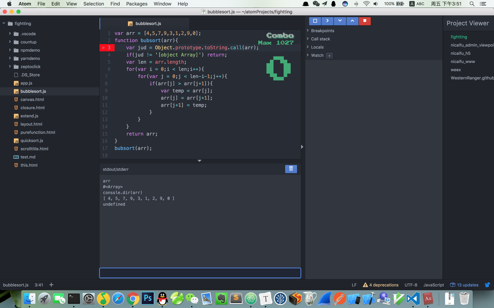

####卸磨杀驴#换了vscode吐槽atom

我是个能折腾的人。从最开始的 sublime text 换到 webstorm， 因为webstorm太过庞大启动速度慢并且每次升级都要破解（好像说多了）。在2016年9月份终于换到了[atom](https://atom.io/)，刚开始觉得atom哪都好，尤其好看的UI和众多的开源[插件](https://atom.io/packages)。后来插件装多了打字偶尔都会卡。最近又从掘金平台看到一篇软文[为什么我从 Sublime Text 跳槽 Visual Studio Code？](https://hungys.xyz/why-i-switched-from-sublime-to-vscode/) 可能是atom的一些缺点我已经忍了很久了吧，果断地弃atom入了[vscode](https://code.visualstudio.com/)的坑～

> 虽然atom有很多槽点，但它也足够酷，酷到足以让你看起来像一个极客。

比如说有个叫`activate-power-mode`的插件，写一行代码有有一种拯救世界的感觉。

比如说编辑区右侧有个combo区域，当你敲击键盘的时候有个数字不断颤动的记录最大连击，他会让你感觉不是在敲代码，更像是在玩游戏。

再比如说有个叫`atom-music`的插件，可以选择你本地的音乐进行播放。

...

我用的atom最爽的插件还是[`project-viewer`](https://github.com/jccguimaraes/atom-project-viewer) 他展示在编辑器右侧，可以实现项目间的快速切换。


当然atom的缺点也明显，萝卜青菜各有所好，暂且抛开atom安装太多插件之后启动速度过慢的问题。给我感觉atom就像是一个刚成长起来的少年，是个潜力股，在很多方面还稍显不足，尤其细节方面。

- SFTP插件的细节问题

  我常用sftp插件。如果你的atom SFTP-deployment插件配置文件deployment-config.json中配置了

  ```
  "uploadOnSave": true
  ```

  就意味着每点击一次cmd+s就会保存并上传的remote服务器。如果此时你在同一个窗口打开了一个其他项目的js文件，保存之后也会上传到当前项目的remote服务器。

  > vscode ftp-sync插件却不会有这个问题

- terminal终端插件不够强大

  虽然atom有terminal-panel插件，但功能很弱，常用的ls pwd cp mv 操作没啥问题。用鼠标在ide里选择需要复制的文字copy都不管用。也不支持tab自动补全。也不支持创建多个terminal。看截图：

  atom terminal-panel

  

  vscode 终端：

  

  > vscode 的 终端不知道要比atom强大多少，支持文本复制、tab自动补全、创建多个terminal等等。

- atom 的 node-debugger体验不佳

  atom通过node-debugger插件可以进行node断点调试，但是无论是启动流程还是断点信息提示都不够友好。

  atom：

  

  > 查看当前数组，直接输入arr无法查看。需要console.dir();

  vscode:

  

  > 直接输入arr就可以清楚的查看数组构成，而且信息相对atom全很多。

最后一句话总结vscode ： 

​	比sublime开源，比atom更快，比webstorm更轻。