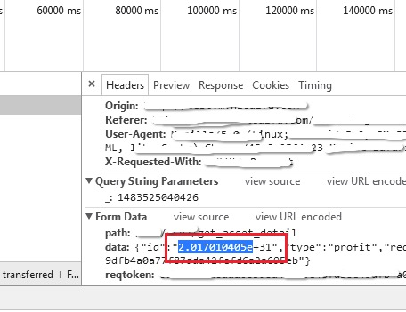
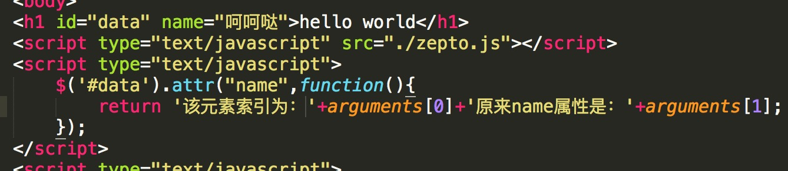

### zepto中$.attr 和 $.data 的区别

今天服务端同学找我，说这个参数应该是string类型，不用转成number。



确实应该是个字符类型啊，怎么就被转成科学计数法了呢。我带着疑惑，找到了form data的赋值：

```
<div id="demo" data-id="234534563456436456456845608456804568">
var id = $('#demo').data('id');
```

我大概是这么写的。用的zepto获取的div标签上的data-id。大神告诉我:

>zepto/jquery的data方法会把获取的数字给强制转化成数字。这里要用attr属性。

所以改成：

```
<div id="demo" data-id="234534563456436456456845608456804568">
var id = $('#demo').attr('data-id');
```

就对啦。

-----

顺手把这个bug改了之后我翻开zepto的源码，嗯，不刨根问底的程序猿不是好猿。

首先看下attr方法：

```
attr: function(name, value){
      var result
      return (typeof name == 'string' && !(1 in arguments)) ?
        (0 in this && this[0].nodeType == 1 && (result = this[0].getAttribute(name)) != null ? result : undefined) :
        this.each(function(idx){
          if (this.nodeType !== 1) return
          if (isObject(name)) for (key in name) setAttribute(this, key, name[key])
          else setAttribute(this, name, funcArg(this, value, idx, this.getAttribute(name)))
        })
    },
```

整个函数就是一个三元表达式，我们分三步来分析：

（1）我们在上文说到attr('data-id')，所以attr函数内部 name是"data-id"，value为""。

```
typeof name == 'string' && !(1 in arguments)
```

`1 in arguments`用来判断第二个参数value是否存在。所以这句执行完是true。[关于in用法戳这里](https://developer.mozilla.org/zh-CN/docs/Web/JavaScript/Reference/Operators/in)

（2）所以该三元表达式最终返回的是：

```
(0 in this && this[0].nodeType == 1 && (result = this[0].getAttribute(name)) != null ? result : undefined)
```

> - 0 in this 保证了该目标元素存在（.attr挂载的元素）
> - this[0].nodeType == 1 保证了.attr挂载的元素类型正确 [关于nodeType戳这里](https://developer.mozilla.org/zh-CN/docs/Web/API/Node/nodeType)
> - 保证万无一失的情况下，attribute属性赋值给了result

所以，在没有第二个参数的情况下，使用attr属性获取number类型的data-id，得到的结果肯定是string类型。

（3）既然看到这里了，我们不妨看下如果attr函数存在第二个参数的情况下，该函数如何赋值的：

```
this.each(function(idx){
          if (this.nodeType !== 1) return
          if (isObject(name)) for (key in name) setAttribute(this, key, name[key])
          else setAttribute(this, name, funcArg(this, value, idx, this.getAttribute(name)))
        })
```

这个函数依赖于如下三个函数

```
function isObject(obj){ return type(obj) == "object" }
```

```
function setAttribute(node, name, value) {
    value == null ? node.removeAttribute(name) : node.setAttribute(name, value)
  }
```

```
function funcArg(context, arg, idx, payload) {
    return isFunction(arg) ? arg.call(context, idx, payload) : arg
  }
```


> - 外层this代表.attr挂载的dom元素列表。
> - this.nodeType !== 1 这一行，把不符合条件的挂载dom对象过滤掉了。
> - isObject(name)，name可以是一个对象，所以就允许你这样写`$('#data').attr({name:2333});`key和value分别对应dom上的key value

单独说一下最后一种else情况：

> 如果value类型不是function（isFunction判断），`$('#data').attr('name':'2333')`类似这种，执行语句可以简化成`setAttribute(this, name, value)`;


> 如果value类型是function，那执行语句就变成了
>
> ```
> setAttribute(this,name,value.call(this,idx,this.getAttribute(name)))
> ```
>
> 这就允许我们这样设置attr：
>
> 	$('#data').attr("name",function(){
> 		return '该元素索引为'+arguments[0];
> 	});

效果是这样滴：


至于那给回调函数传递name值的参数，我想作者的意图应该是：如果该dom元素本来一个name属性，比如叫'呵呵哒'，



那么我可以把它作为一部分拼接到新name属性里：


纯属我猜测，有不同意见的同学可以找我私聊。

----


然后我们分析data方法怎么实现的以及它怎么做的数据类型转化：

```
data: function(name, value){
      var attrName = 'data-' + name.replace(capitalRE, '-$1').toLowerCase()

      var data = (1 in arguments) ?
        this.attr(attrName, value) :
        this.attr(attrName)

      return data !== null ? deserializeValue(data) : undefined
    },
```

打眼一看，这个方法依赖三个作用域外的变量&函数，`capitalRE`，`this.attr`，`deserializeValue`。我们分三步分析一下data方法：

```
var capitalRE = /([A-Z])/g;
```

（1）很明显，如果给div设置了data-id，attrName就是`data-id`；如果data属性设置为了大写的ID，那么按照这个正则匹配，attrName就是`data--i-d`了。


我总感觉data自定义属性应该不区分大小写，其实如果按照我这种逻辑，只需要把replace的第二个参数'-$1'的'-'去掉 即可：

```
var attrName = 'data-' + 'ID'.replace(/([A-Z])/g, '$1').toLowerCase()
```

关于$1的含义，[不懂得朋友可以戳](https://developer.mozilla.org/zh-CN/docs/Web/JavaScript/Reference/Global_Objects/RegExp/n)

可能zepto／jquery设计的初衷就是不让data自定义属性出现大写字母吧。

（2）接下来就是对data方法参数的判断了：

>- 1 in arguments 第二个参数存在，调用attr方法，执行setAttribute操作；
>
>
>- 只存在一个参数，调用attr方法，执行getAttribute操作；

（3）重点是最后把`deserializeValue(data)`return了。 看来data-id的值真的被处理了。找到deserializeValue函数的定义：

```
function deserializeValue(value) {
        try {
            return value ?
            value == "true" ||
            ( value == "false" ? false :
                value == "null" ? null :
                    +value + "" == value ? +value :
                        /^[\[\{]/.test(value) ? $.parseJSON(value) :
                            value )
                : value
        } catch (e) {
            return value
        }
    }
```

把这函数读下来就发现，我们如果传入一个比较大的number类型-'234534563456436456456845608456804568'它会以“+value”的形式返回。


一切真相大白了。